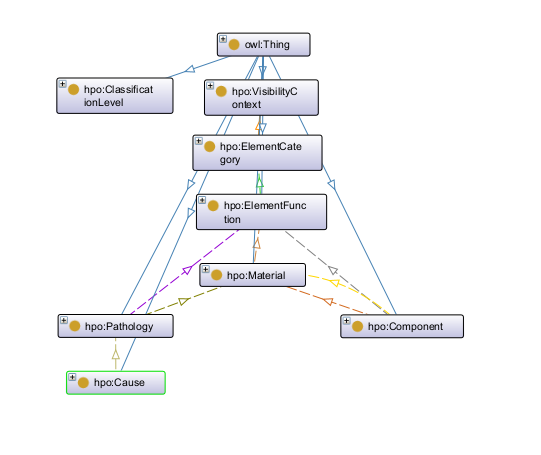

# Heritage Pathology Ontology

This repository contains a modular RDF/OWL ontology for structuring heritage and building inspection observations, as well as sample SPARQL queries. The ontology individuals are written in French.

The ontology models the relationships between inspection contexts, element categories and their functions, materials, affected components, observed pathologies and their causes, and classification levels. It is intended to support structured data entry, controlled vocabularies, semantic constraints, and analysis of these observations.

<p align="center">
  
</p>

<p align="center">
  Overview of the main ontology concepts and relationships.
</p>

## Example use case

The ontology can be used to analyze and answer questions such as the following:

* Which element categories are relevant in a given visibility context?
* Which functions are possible for a given element category?
* Which components are compatible with a material or function?
* Which pathologies are compatible with a material or function?
* Which causes may explain a given pathology?
* How can observations be grouped by material, component, pathology, cause, or classification level?

## Namespace

The ontology currently uses the namespace:

```txt
https://example.org/heritage-pathology-ontology#
```

This namespace is used as a neutral placeholder for the current version.

## Main concepts

The ontology includes the following main classes:

* `hpo:Observation`
* `hpo:VisibilityContext`
* `hpo:ElementCategory`
* `hpo:ElementFunction`
* `hpo:Material`
* `hpo:Component`
* `hpo:Pathology`
* `hpo:Cause`
* `hpo:ClassificationLevel`

## Main relationships

The ontology describes relationships such as:

* `hpo:allowedInVisibilityContext`
* `hpo:allowedForElementCategory`
* `hpo:allowedForElementFunction`
* `hpo:componentAllowedForElementFunction`
* `hpo:componentAllowedForMaterial`
* `hpo:pathologyAllowedForElementFunction`
* `hpo:pathologyAllowedForMaterial`
* `hpo:causeAllowedForPathology`

These relationships make it possible to constrain and query inspection data. For example, a material can restrict the possible components and pathologies, while a pathology can restrict the possible causes.

## Repository structure

```txt
ontology/
  core.ttl
  taxonomy-basic.ttl
  materials.ttl
  components.ttl
  pathologies.ttl
  causes.ttl
  observation-examples.ttl
  heritage-pathology-ontology.ttl

queries/
  q1-list-observations.rq
  q2-causes-for-pathology.rq
  q3-pathologies-for-function-and-material.rq
```

## Ontology files

* `core.ttl`: defines the core classes and properties.
* `taxonomy-basic.ttl`: defines basic taxonomy and classification concepts.
* `materials.ttl`: defines material-related individuals and relations.
* `components.ttl`: defines building or heritage components.
* `pathologies.ttl`: defines observed pathologies.
* `causes.ttl`: defines possible causes and their links to pathologies.
* `observation-examples.ttl`: contains (3) example observation instances.
* `heritage-pathology-ontology.ttl`: combines all .ttl files into one, to facilitate querying.


## Example SPARQL queries

The `queries/` directory contains example SPARQL queries, including:

* listing observations;
* retrieving causes associated with a pathology;
* retrieving pathologies associated with a function and material.

### Running the queries with Apache Jena

The example queries can be executed with a SPARQL engine such as [Apache Jena](https://jena.apache.org/). Jena includes ARQ, a SPARQL query engine, and provides command-line tools such as `sparql` and `arq`. :contentReference[oaicite:1]{index=1}

Install Java first. Jena 6 requires Java 21 or later.

On Ubuntu/Debian:

```bash
sudo apt update
sudo apt install openjdk-21-jdk
```

Example using Apache Jena ARQ:

```bash
sparql --data ontology/heritage-pathology-ontology.ttl --query queries/q1-list-observations.rq
```


## References and methodology

The ontology was developed using both methodological and domain-oriented references.

### Ontology methodology

- **Ontology Development 101: A Guide to Creating Your First Ontology**  
  Used as an introductory methodological guide for defining the ontology scope, identifying competency questions, organizing classes and properties, and iterating over the model.

### Domain references

The domain vocabulary and modeling choices were informed by several resources related to building inspection, maintenance, and heritage pathology:

- **Guide pour la surveillance et l'entretien courant des ouvrages d'art liés à la voirie ou son exploitation à l’usage des communes et des communautés de communes**  
  Used as a reference for maintenance-oriented vocabulary and inspection concerns related to civil and heritage structures.

- **ICOMOS-ISCS Illustrated Glossary on Stone Deterioration Patterns / Glossaire illustré sur les formes d’altération de la pierre**  
  Used as a reference for terminology related to stone deterioration patterns and pathology naming.

- **Technical rehabilitation and maintenance sheets for traditional architecture**  
  Used as a practical reference for structuring observations, intervention logic, and building-maintenance concepts.

These resources helped guide the vocabulary, the grouping of concepts, and the relationships between materials, components, observed pathologies, and possible causes.

The ontology is not a direct transcription of these documents. They were used as references to inform terminology, scope, and modeling choices.
